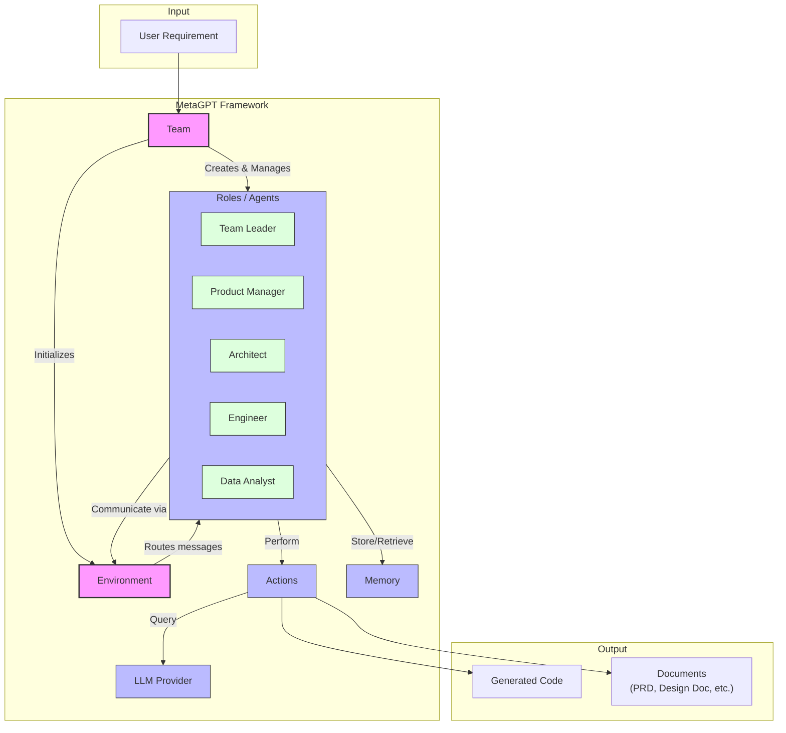
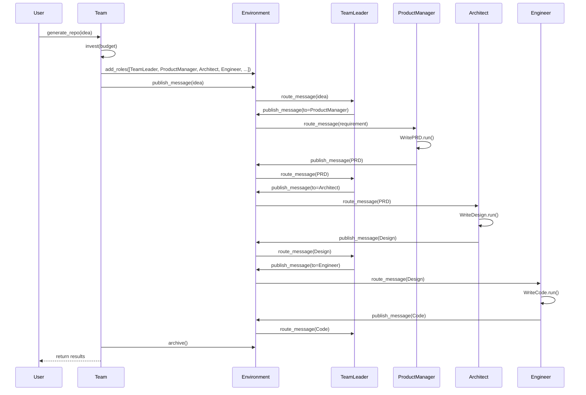
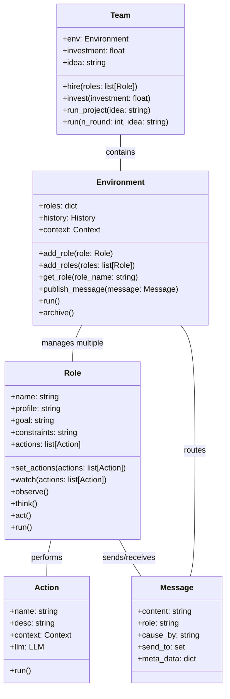
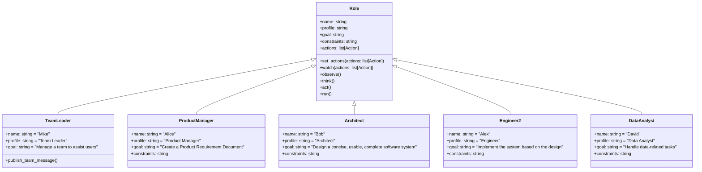
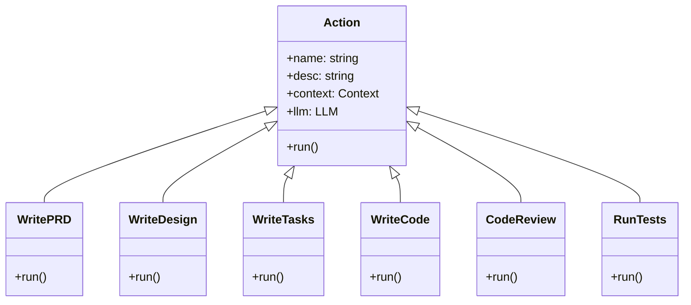

# MetaGPT Technical Architecture

This document outlines the technical architecture of MetaGPT, a multi-agent framework that simulates a software development company with different AI roles collaborating to develop software from simple requirements.

## 1. Overall Architecture

The MetaGPT framework is designed to simulate a software development company where multiple AI agents with different roles (e.g., Product Manager, Architect, Engineer) collaborate to develop software from a simple requirement. The system uses a modular, agent-based architecture where each role has specific responsibilities and communicates with other roles through a shared environment.

## 2. Core Components

### 2.1 Team

The `Team` class is the central orchestrator that manages a collection of AI agents (roles) and the environment in which they operate. It serves as the main entry point for users to create and manage a virtual software development team.

Key responsibilities:
- Hiring roles (agents) with different specializations
- Managing the team's budget and resources
- Initializing the environment for agent communication
- Starting projects based on user requirements
- Coordinating the execution of the multi-agent workflow

### 2.2 Environment

The environment is a shared space that facilitates communication between different roles. It maintains the message history, manages communication channels, and ensures proper message routing between agents.

Key responsibilities:
- Maintaining the agent registry
- Routing messages between agents
- Managing the project context
- Tracking the state of the multi-agent system
- Archiving the project history

### 2.3 Roles / Agents

Roles represent different specializations found in a typical software development company. Each role has specific responsibilities, goals, and capabilities.

Main roles include:
- **Team Leader**: Coordinates the team and assigns tasks to appropriate roles
- **Product Manager**: Creates product requirements documents (PRD)
- **Architect**: Designs the system architecture
- **Engineer**: Implements the code based on requirements and design
- **Data Analyst**: Handles data-related tasks and analysis

### 2.4 Actions

Actions represent specific tasks that roles can perform. Each role has a set of actions it can execute based on its responsibilities.

Common actions include:
- WritePRD: Creates a product requirement document
- WriteDesign: Creates a system design document 
- WriteCode: Implements code based on requirements and design
- CodeReview: Reviews and suggests improvements to code
- RunTests: Creates and executes tests

### 2.5 Memory

Memory allows agents to store and retrieve information from previous interactions, which is essential for maintaining context and coherence in the development process.

## 3. Sequence Diagram

The following sequence diagram illustrates the main flows and interactions within the MetaGPT system when a new software development project is initiated:

## 4. Data Models

The following class diagrams show the key data models and their relationships in the MetaGPT framework:

### 4.1 Core Classes

### 4.2 Specialized Roles

### 4.3 Actions Hierarchy

## 5. Implementation Details

### 5.1 Software Development Workflow

MetaGPT implements a standard software development workflow:

1. **Requirement Analysis**: The Product Manager receives the initial user requirement and creates a comprehensive PRD.
2. **System Design**: The Architect receives the PRD and creates a system architecture design.
3. **Task Planning**: Tasks are identified and distributed among the team.
4. **Implementation**: Engineers write the code according to the design and requirements.
5. **Quality Assurance**: Code reviews and testing ensure the quality of the implementation.
6. **Delivery**: The final product is delivered, including source code and documentation.

### 5.2 Multi-agent Communication

Agents communicate through a message-passing system:

1. Each role can publish messages to the environment
2. Messages include metadata about the sender, intended recipients, and context
3. The environment routes messages to the appropriate recipients
4. Roles observe incoming messages and react accordingly

### 5.3 LLM Integration

MetaGPT is designed to work with various LLM providers:

- OpenAI (GPT-3.5, GPT-4)
- Azure OpenAI
- Anthropic
- Groq
- Local LLMs

The framework abstracts away the specific LLM implementation details, making it easy to switch between different providers.

## 6. Extensibility

MetaGPT is designed to be highly extensible:

- **Custom Roles**: Users can create custom roles with specific responsibilities
- **Custom Actions**: New actions can be defined to extend the capabilities of roles
- **Custom Workflows**: The interaction pattern between roles can be modified
- **Plugin System**: Additional functionality can be added through plugins

## 7. Conclusion

The MetaGPT architecture provides a flexible and powerful framework for creating AI-driven software development teams. By decomposing the software development process into specialized roles and defining clear communication channels, the system can effectively generate complete software projects from simple requirements.

The modular design of the framework makes it adaptable to different domains and use cases, while the agent-based approach allows for natural collaboration and division of labor in complex tasks.